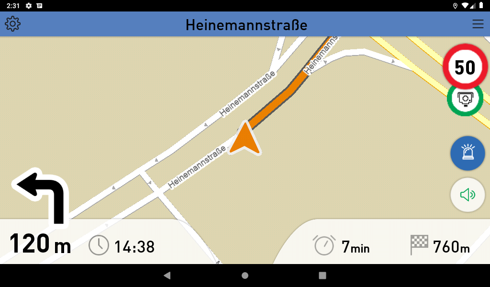

# SMS App For MapTrip112

SMS [MapTrip112] (https://www.maptrip.de/112) is an app to start MapTrip from an incoming SMS. The app is based on our MapTripInterface (MTI) and uses built-in mechanism from Android OS to listen to the incoming standard SMS. When a new SMS is received, the app gets a notification from the Android OS and parses the SMS. If the SMS contains information in one of the known formats, the application comes to the foreground and suggests to start navigation.

## Preview

## Building the project.

This project contains different build variants, make sure to use the "standardsms" variant. You can either download the project or create a pull requests, and open it in Android Studio. Now that you have the code base you can adjust the code if wanted, and create an APK or build it directly on your device.

## Using the App

In order to use this application you will need to have MapTrip installed on your device as well. If you do not have MapTrip yet, do not hesitate to [contact](https://www.infoware.de/kontakt/) us.
For demo purposes, the use case requires that your application is already running. Currently it is not possible to parse SMS when the application is not launched. As you are ready to go, just send a message related to your medium in one of the formats addressed below.
Once a message arrives, the application will parse it and if the message matches given patters it will launch and display a notification to start a navigation to the destination. It is not required that MapTrip is already running, the app will care for it if not. Depending on the "SoSi" tag in your message, MapTrip will also use emergency routing.
Received messages will be stored in a SQLite Database so you can always start a navigation again to the destination.

## Preview of MapTrip using emergency routing

## Supported Formats

### Default SMS Format:

The message has the format of {LAT}, {LONG}

As optional parameters, SoSi and Free Text paramters are available:
- {LAT}, {LONG}; SoSi
- {LAT}, {LONG}; FreeText
- {LAT}, {LONG}; SoSi; FreeText

**Examples**
- 51.2123544, 6.12548543
- 51.2123544, 6.12548543;SoSi
- 51.2123544, 6.12548543;Zimmerbrand Musterstrasse 26 3:OG
- 51.2123544, 6.12548543;SoSi;Zimmerbrand Musterstrasse 26 3:OG
